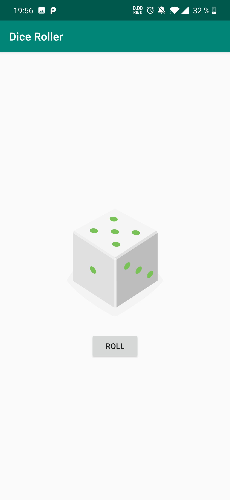

## Lesson 01: Dice Roller - Tripi&#x0107; Nenad

**Contents:**

 - Installing Android Studio
 - Setting up Android Studio
 - Emulate Devices - I am using a physical Device so no use for that
 - Allowing USB-Debugging on my phone
 - Introducing project structure - Anatomy
 - Explained Activity and Layout
 - Button
 - Images
 - Efficiency -> lateinit
 - Explanation of gradle
 - Vector Drawables - support for older devices


## Key takeaways - What was new for me?

**lateinit var**

Normally, properties declared as having a non-null type must be initialized in the constructor. However, fairly often this is not convenient. For example, properties can be initialized through dependency injection, or in the setup method of a unit test. In this case, you cannot supply a non-null initializer in the constructor, but you still want to avoid null checks when referencing the property inside the body of a class.

**Vector drawables**

Supported SDK > 21, gradle generates png-files that are below that SDK. This leads to larger apps, slow downloads and more usage of valubale space! To solve this add to `build.gradle(app)`  AndroidX Library: 

```
vectorDrawables.useSupportLibrary = true
```
Use this `namespace` in the *Layout-files*: 

```
xmlns:app="http://schemas.android.com/apk/res-auto"
```

Then you can use images like this:
```
app:srcCompat="@drawable/empty_dice"
```
~~android:src="@drawable/empty_dice"~~

## User-Interface

