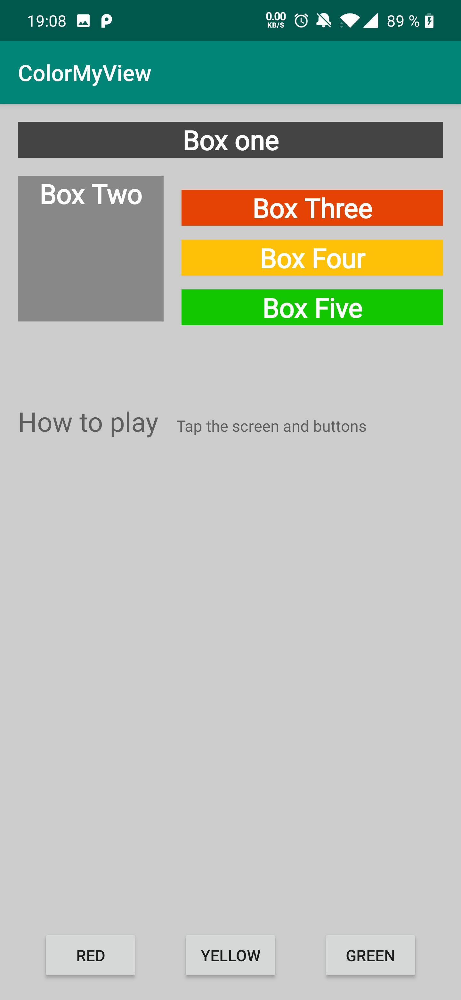

## Lesson 02: Views - Tripi&#x0107; Nenad

**Contents:**

 - Views
 - Constraints
 - Ratios
 - Chaining
 - Baseline constraint

## Key takeaways - What was new for me?

### Chaining

### Baseline constraint

## User-Interface

