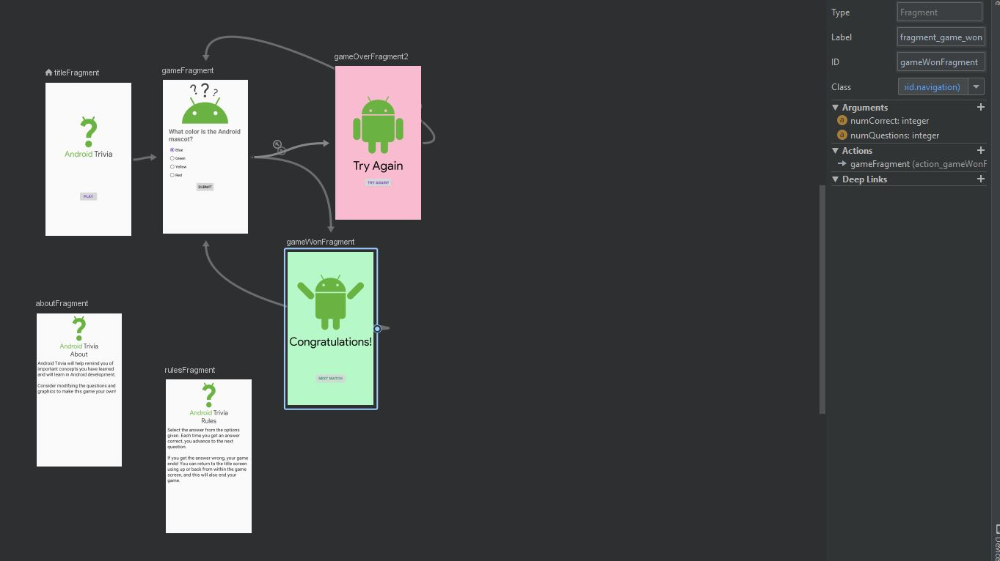
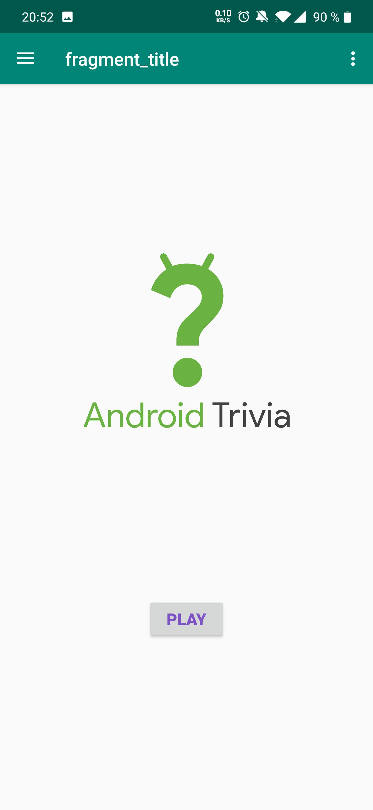
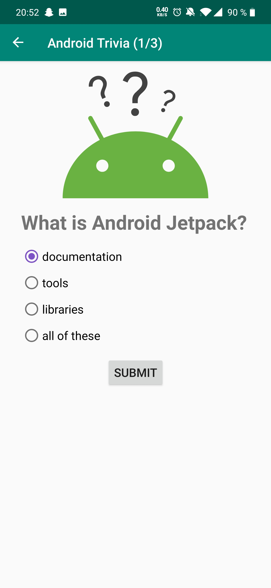

## Lesson 03: Android Trivia - Tripi&#x0107; Nenad

**Contents:**

 - Clone [GitHub Repo](https://github.com/udacity/andfun-kotlin-android-trivia) from the course
 - Fragments
 - Navigation Component
 - Navigation graph
 - Conditional navigation
 - Back stack manipulation
 - Safe arguments
 - Intents and Sharing
 - Navigation drawer
 - Animations

## Key takeaways - What was new for me?

**Navigation Principles**
1. Principle
	There's always a starting place!
2. Principle
	You can always go back! Structure: LIFO - Last In First Out -> Navigation stack
3. Principle
	Up goes back!

**Back stack manipulation**

**Safe arguments**

**Sharing with intents**

**Navigation Drawer**

## User-Interface

