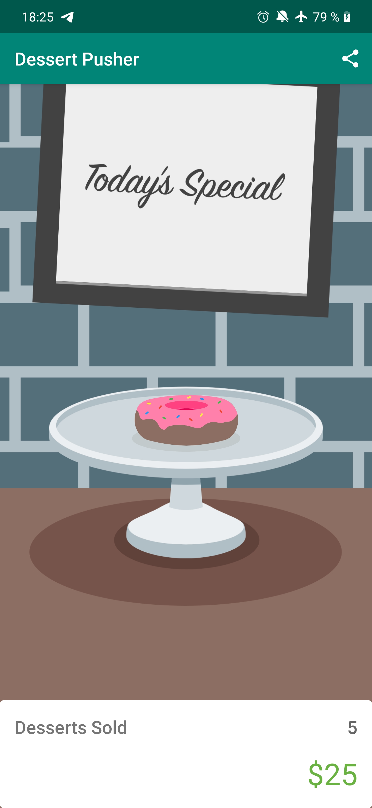

## Lesson 04: Dessert Pusher - Tripi&#x0107; Nenad

**Contents:**

 - Activity lifecycle in general
 - Activity lifecycle states
 - Activity lifecycle state callbacks
 - Logging
 - Timber (a logging library)
 - Application Class
 - Setup and teardown
 - LifecycleObserver
 - onSaveInstanceState
 - Configuration change
 - have a look at the [screenshots](https://github.com/1920-5bhif-nvs/1920-5bhif-nvs-udacity-labs-TripicNenad/tree/master/Lesson04_Dessert_Pusher/screenshots), there are good explanations


## Key takeaways - What was new for me?

## Activity lifecycle

Every activity lifecycle has **states** and every state has its own callback methods.


### General Definitions

 - **Visible Lifecycle:** The part of the Lifecycle between onStart and onStop when the Activity is visible.
   
 -  **Focus:** An Activity is said to have focus when it's the activity the user can interact with.
   
  - **Foreground:** When the activity is on screen.
   
  - **Background:** When the activity is fully off screen, it is considered in the background.


### Lifecycle States

These are the same for both the Fragment Lifecycle and the Activity Lifecycle.

- **Initialized:** This is the starting state whenever you make a new activity. This is a transient state -- it immediately goes to Created.

- **Created:** Activity has just been created, but it’s not visible and it doesn’t have focus (you’re not able to interact with it).

- **Started:** Activity is visible but doesn’t have focus.

- **Resumed:** The state of the activity when it is running. It’s visible and has focus.

- **Destroyed:** Activity is destroyed. It can be ejected from memory at any point and should not be referenced or interacted with.

- [Further details](https://classroom.udacity.com/courses/ud9012/lessons/e487c600-ed68-4576-a35a-12f211cf032e/concepts/4c1503f9-2de5-45ea-88ae-2138b0482ecc)


### Logging
```
Log.i("MainActivity", "onCreate called")
```
Logs have different levels which are used in different situations. The levels and their usages are listed below:

-   **Verbose**: Show all log messages (the default).
-   **Debug**: Show debug log messages that are useful during development only, as well as the message levels lower in this list.
-   **Info**: Show expected log messages for regular usage, as well as the message levels lower in this list.
-   **Warn**: Show possible issues that are not yet errors, as well as the message levels lower in this list.
-   **Error**: Show issues that have caused errors, as well as the message level lower in this list.
-   **Assert**: Show issues that the developer expects should never happen.


### Application class
A base class that contains global application state for your entire app.


### LifecycleObserver

    @OnLifecycleEvent(Lifecycle.Event.ON_START)  
	fun startTimer() {}

## User-Interface



