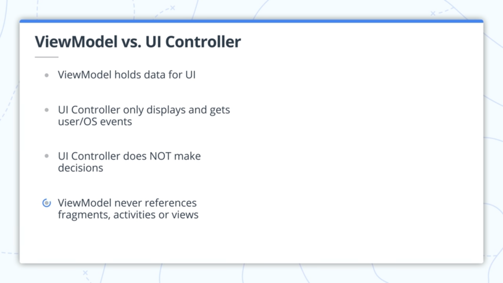

## Lesson 05: Guess it - Tripi&#x0107; Nenad

**Contents:**

 - Application Architecture
 - ViewModels
 - LiveData
 - Lifecycle awareness
 - LiveData encapsulation
 - Event vs. State
 - Timer
 - ViewModelFactory
 - Transformations - maps
 - Buzzer (= Vibration)

## Key takeaways - What was new for me?

### Application Architecture
The design of an application's classes and relationships between them.

#### Seperation of Concerns
Divide your code into classes, each with separate, well-defined responsibilities.

#### ViewModel
Abstract class that holds your app's UI data. **Survives** configuration changes. [Saving UI States](https://developer.android.com/topic/libraries/architecture/saving-states)

Adding a Viewmodel:
 1. Add dependency in build.gradle(Module: App)
	 1.2.  `implementation 'androidx.lifecycle:lifecycle-extensions:2.0.0'`
 2. Subclass ViewModel
 3. Associated UI Controller and ViewModel

[Details](https://developer.android.com/topic/libraries/architecture/viewmodel)

### ViewModel vs. UI Controller

### LiveData
An observable data holder class that is lifecycle-aware. LiveData follows the observer pattern. LiveData notifies [`Observer`](https://developer.android.com/reference/androidx/lifecycle/Observer.html) objects when the lifecycle state changes. You can consolidate your code to update the UI in these `Observer` objects. Instead of updating the UI every time the app data changes, your observer can update the UI every time there's a change.

### Encapsulation or backing property

    // _score is mutable and private. This ensures that it only can be read but not mutable publicly  
    private val _score = MutableLiveData<Int>()  
    val score : LiveData<Int>  
        get() = _score

### ViewModelFactory
A class that knows how to create ViewModels.

## User-Interface

