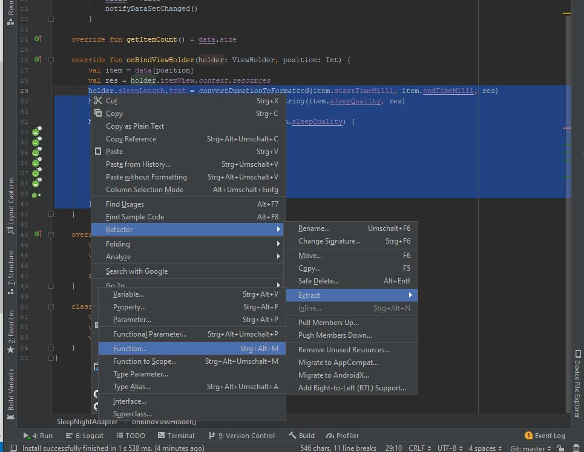
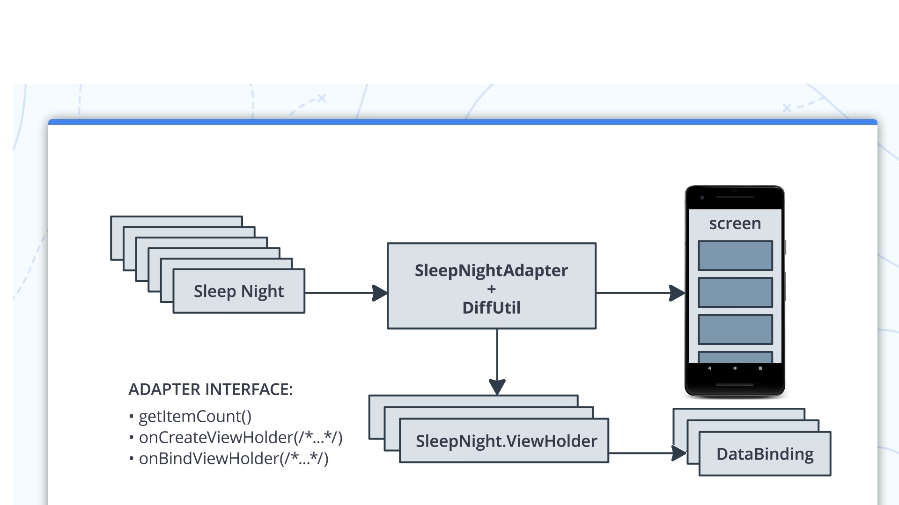
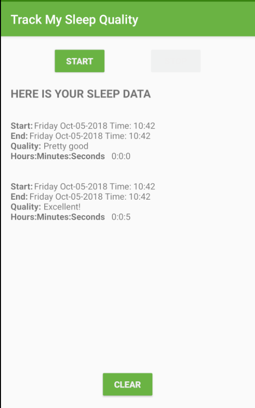

##	Lesson 07: Sleep tracker with RecyclerView - Tripi&#x0107; Nenad

**Contents:**

 - RecyclerView
 - RecyclerView Adapter
 - RecyclerView ViewHolder
 - Refresh data with DiffUtil
 - Binding Adapter

## Key takeaways - What was new for me?

### RecyclerView
A flexible view for providing a limited window into a large data set. Android [RecyclerView](http://developer.android.com/reference/android/support/v7/widget/RecyclerView.html) is more advanced version of ListView with improved performance and other benefits.

### RecyclerView Adapter
Adapters provide a binding from an app-specific data set to views that are displayed within a RecyclerView.

### RecyclerView ViewHolder
A ViewHolder describes an item view and metadata about its place within the RecyclerView.
RecyclerView.Adapter implementations should subclass ViewHolder and add fields for caching potentially expensive findViewById(int) results.

### DiffUtil
DiffUtil is a utility class that can calculate the difference between two lists and output a list of update operations that converts the first list into the second one. DiffUtil uses Eugene W. Myers's difference algorithm to calculate the minimal number of updates to convert one list into another. Myers's algorithm does not handle items that are moved so DiffUtil runs a second pass on the result to detect items that were moved.

### Refactoring code with AndroidStudio

## Structure

## User-Interface

