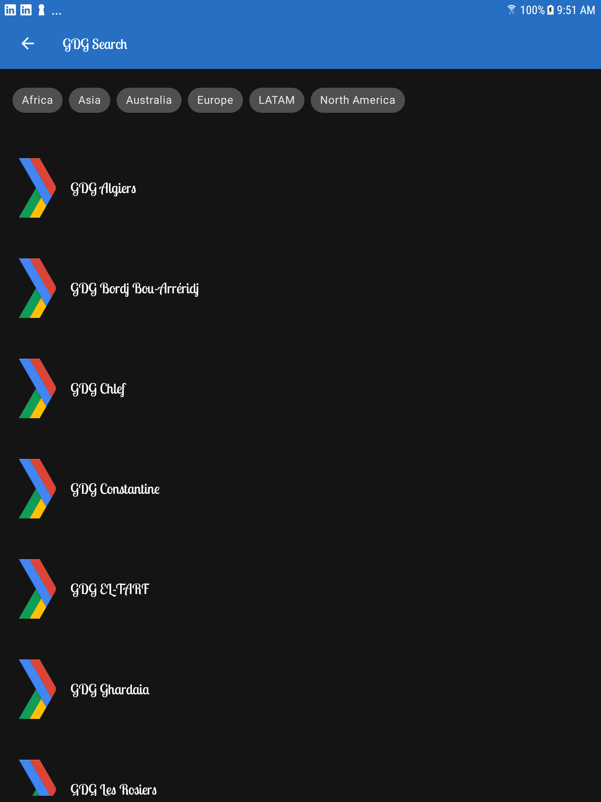

##	Lesson 09: Styling for everyone - Tripi&#x0107; Nenad

**Contents:**

 - Styling in general
 - Attributes
 - Themes
 - Light & Dark Mode
 - Fonts
 - Style
 - Material Design
 - Consistent styling
 - Dimens
 - RTL Language support

## Key takeaways - What was new for me?
Basically everything was new. There isn't much to say about the things I learned. To see further details go to the course.

## User-Interface

